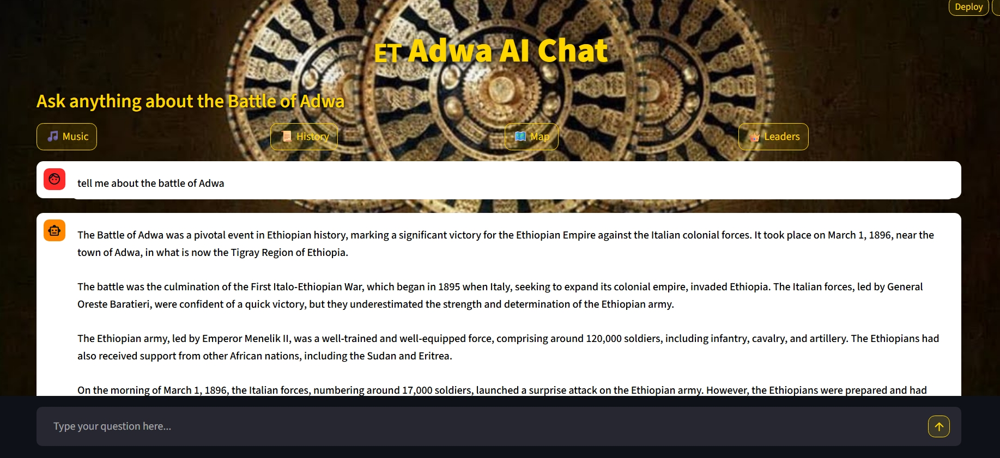
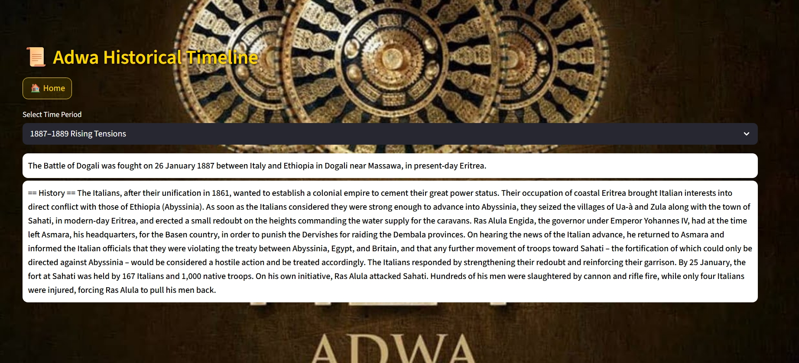
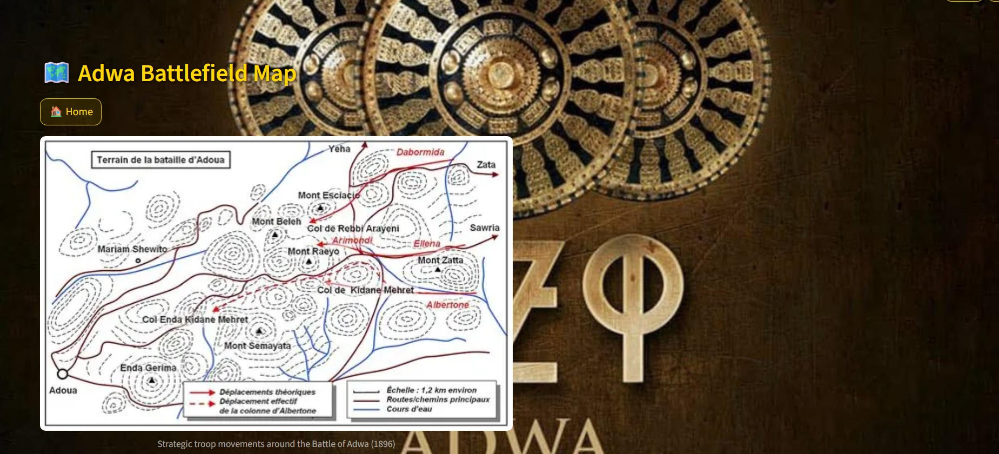
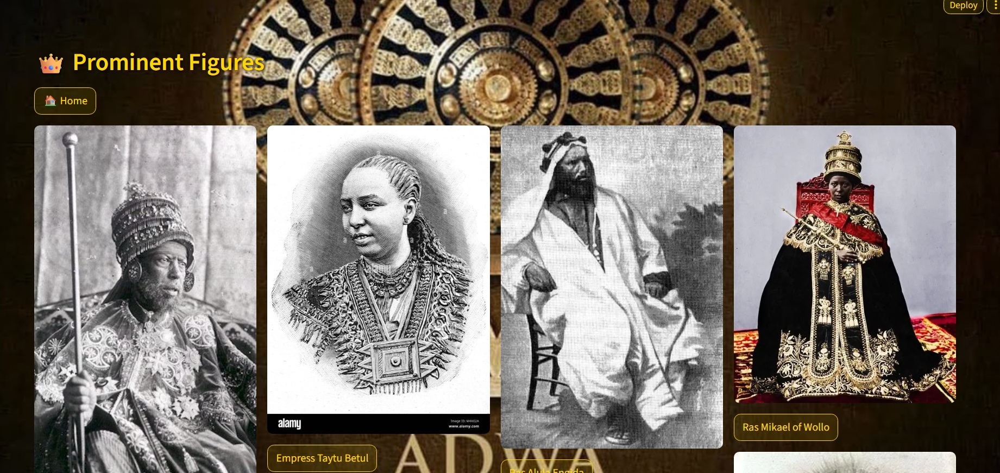

# 🇪🇹 Adwa AI Chatbot

### History Meets Intelligence

The **Adwa AI Chatbot** is an interactive, professional-grade chatbot designed to educate and engage users about the historic **Battle of Adwa (1896)**. This tool combines AI-driven responses, curated multimedia, and historical resources to provide a seamless, immersive learning experience about Ethiopia's legendary victory.

---

## 🌟 Features

- **Interactive Chat**: Ask any question about the Battle of Adwa and receive detailed, AI-generated responses.
- **Historical Timeline**: Explore major events in Ethiopian history related to Italy with precise year ranges.
- **Multimedia Dashboard**:
  - **Music**: Listen to historically-inspired songs commemorating the battle.
  - **Maps**: View strategic maps and troop movements during the conflict.
  - **Prominent Figures**: Learn about key individuals, spies, and women who contributed to the Ethiopian victory.

- **Professional UI**: Clean, responsive design with a striking full-background image and elegant gold-themed accents.
- **Focused Content**: Ensures the user receives only relevant historical and cultural information about Adwa.

---

## 🖥️ Screenshots


_Interactive chat interface with gold-accented buttons and full background image._


_Explore the Ethiopian timeline with concise, informative text._


_Strategic maps with key terrain points clearly highlighted._


_Profiles of Ethiopian leaders, spies, and women influential in the battle._

---

## ⚡ Installation & Setup

### Prerequisites

- Python 3.10+
- [Streamlit](https://streamlit.io/)
- [FastAPI](https://fastapi.tiangolo.com/)
- Other dependencies listed in `requirements.txt`

### Steps

1. **Clone the repository**

```bash
git clone https://github.com/yourusername/adwa-ai-chatbot.git
cd adwa-ai-chatbot
```

2. **Create a virtual environment (recommended)**

```bash
python -m venv venv
source venv/bin/activate  # On Windows: venv\Scripts\activate
```

3. **Install dependencies**

```bash
pip install -r requirements.txt
```

4. **Run the backend API**

```bash
uvicorn backend:app --reload
```

5. **Run the Streamlit frontend**

```bash
streamlit run app.py
```

Open your browser at `http://localhost:8501` to start interacting.

---

## 🧩 Project Structure

```
adwa-ai-chatbot/
├─ chat.py               # Streamlit frontend
├─ app.py           # FastAPI backend
├─ requirements.txt
├─ README.md
├─ assets/             # Images, maps, music links
└─ .env                # API keys for AI services (if needed)
```

---

## 🎨 UI & Design Philosophy

- **Gold & Black Theme**: Reflecting Ethiopian heritage and the prestige of the Adwa victory.
- **Full-Page Background**: Engaging, clean, and visually immersive without overlaying content.
- **Minimalist Navigation**: Music, History, Map, Leaders buttons located above the chat for professional workflow.
- **White Content Boxes**: All chat messages and historical info sections appear on clean white backgrounds for readability.

---

## 📜 Sources & References

- [Battle of Adwa - Wikipedia](https://en.wikipedia.org/wiki/Battle_of_Adwa)
- [Menelik II - Wikipedia](https://en.wikipedia.org/wiki/Menelik_II)
- [Taytu Betul - Wikipedia](https://en.wikipedia.org/wiki/Taytu_Betul)
- Historical maps and multimedia curated from public domain archives

---

## 🚀 Future Enhancements

- **Zoomable Maps & Lightbox Effect** for detailed troop movements
- **Audio Narration** of historical events for immersive experience
- **Expanded Multimedia**: More songs, poems, and cultural artifacts related to Adwa
- **AI Improvements**: Context-aware responses and deeper storytelling

---

📞 Contact

Developer: Kalkidan Shewit
Project Vision: To educate and engage the public about Ethiopian heritage in a professional, interactive way.
